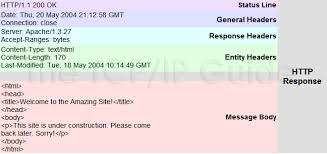

# Clase 1

¡Bienvenidos a la clase número 1!

Durante este curso van a aprender qué es una API REST, como construir una API REST y como probarla. A lo largo de las clases vamos a ir armando una API QUE HACE X

Los temas de esta clase son:
  * [Qué es una API](#que-es-una-api)
  * [Cómo se usa una API](#como-se-usa-una-api)
  * [Qué significa ser REST](#que-significa-ser-rest)
  * [Qué es Django](#que-es-django)
  * [Cómo se arma un endpoint](#como-se-arma-un-endpoint)

***

## Que es una API

Antes que nada, vamos a ver que es una *API*. Hoy en día se escucha mucho el término, pero es normal que uno no sepa lo que es si nunca lo investigó. 

Una *API* es una **Application Programming Interface**. Básciamente es un intermediario entre 2 aplicaciones que necesitan comunicarse.

Se puede pensar la siguiente analogía:

```
Imaginense que están en un restaurante y tienen un menú para elegir. La cocina (o "server") va a preparar lo que ustedes pidan. Uno no va directamente a la cocina a pedir comida, necesita de un mozo (o "API") para poder comunicarle su pedido a la cocina. El mozo toma el pedido (o "request") y se lo lleva a la cocina, que una vez que prepara la comida (o "response"), se la devuelve al mozo y el mozo te lo lleva a tu mesa (o "cliente").
```

Una *API* se usa porque provee una mayor seguridad al servidor que está detrás de la misma, además de simplificar la comunicación entre el cliente y el servidor. 

***

## Como se usa una API

Hay varias formas de comunicarse con una API, pero nos vamos a concentrar en el estándar **HTTP** y como hacer una *HTTP Request*.

**HTTP** es el *[Hypertext Transfer Protocol]((https://en.wikipedia.org/wiki/Hypertext_Transfer_Protocol))*, es un protocolo de aplicación basado en el esquema *request-response*. El cliente manda una *request* al servidor, y el servidor response con una *response*.

HTTP define un [conjunto de métodos](https://developer.mozilla.org/en-US/docs/Web/HTTP/Methods) o **verbos HTTP** para indicar que acción se quiere ejecutar sobre el recurso deseado. Si bien hay muchos métodos, nos vamos a concentrar en los que vamos a usar durante el curso:
 - **GET** --> Pide una representación del recurso especificado, es el más común de los métodos, los browsers lo usan cuando se busca algo en Google por ejemplo. *Solo debería buscar información*.
 - **POST** --> Sirve para crear o subir una entidad al recurso especificado.
 - **PUT** --> Sirve para reemplazar todas las representaciones del recurso especificado.
 - **DELETE** --> Borra el recurso especificado.

Si tuvieramos que resumir en 1 palabra para que se usa cada método diríamos:
 - **GET** --> *buscar*
 - **POST** --> *crear*
 - **PUT** --> *actualizar*
 - **DELETE** --> *borrar*

### Como se compone una request HTTP

Toda [request HTTP](https://developer.mozilla.org/en-US/docs/Web/HTTP/Messages#http_requests) se compone de 4 partes:
 - Una "request line"
 - Cero o más [headers](https://developer.mozilla.org/en-US/docs/Web/HTTP/Headers) (uno en cada línea)
 - Una línea en blanco
 - Un "body" opcionalmente

Los *GET* y *DELETE* no llevan body.

Siendo más concretos, una request es:
```
METODO URI/URL VERSION_HTTP
Host: localhost:8080
Connection: keep-alive

BODY
```

Un ejemplo puntual es:


### Como se compone una response HTTP

Toda [response HTTP](https://developer.mozilla.org/en-US/docs/Web/HTTP/Messages#http_responses) se compone de 4 partes también:
 - Una "status line"
 - Cero o más [headers](https://developer.mozilla.org/en-US/docs/Web/HTTP/Headers) (uno en cada línea)
 - Una línea en blanco
 - Un "body" opcionalmente

Siendo más concretos, una response es:
```
VERSION_HTTP CODIGO_DE_STATUS MENSAJE_DE_STATUS
Host: localhost:8080
Connection: keep-alive

BODY
```

Un ejemplo puntual es:



### Como hacemos una request HTTP

Es muy simple hacer una request HTTP, hay muchas herramientas que permiten hacerlo, algunas ya vienen instaladas en la computadora, como **Curl** y otras se pueden instalar, como **Postman**, pero a fin de cuentas termina siendo un curl lo que hacen esas otras herramientas.

Vamos a probar hacer un GET (en este caso la request no tiene headers ni body) usando Curl (si no tienen Curl en sus computadoras, pueden usar esta [página](https://reqbin.com/curl) para hacerlas):
```bash
curl -XGET google.com
```

Esto debería devolver algo similar a:
```
HTTP/1.1 200 OK
Expires: -1
{MAS HEADERS}
Transfer-Encoding: chunked

<!doctype html>{MAS HTML}</html>
```

***

## Que significa ser REST

**REST** significa *[Representational State Transfer](https://en.wikipedia.org/wiki/Representational_state_transfer)*, y es un estándar en la arquitectura de software.

Para que una API sea considerada *REST* o *RESTful* debe cumplir una serie de [criterios](https://www.redhat.com/en/topics/api/what-is-a-rest-api):
 - Debe tener una arquitectura compuesta de clientes, servidores y recursos, con requests HTTP.
 - Debe ser **stateless** la comunicación entre cliente y servidor, no hay información de sesión guardada entre request y request, cada request debería tener todo lo necesario para poder resolverla.
 - Las interacciones deben ser cacheables.
 - Una interfaz uniforme entre los componentes, de manera que:
     + los recursos son identificables y distinguibles.
     + los recursos deben poder ser manipulables a partir de la representación recibida.
     + los mensajes deben ser descriptivos para indicarle al cliente como procesar la información.
     + hipertexto/hipermedia disponible, el cliente puede usar hipervínculos para acceder a la información relacionada al recurso.
 - Un sistema en capas que organiza cada servidor involucrado en el procesamiento de una request, todo invisible para el cliente.
 - Código-on-demand (opcional), que es la habilidad de enviar código ejecutable del servidor al cliente para extender la funcionalidad del cliente 

*¿Por qué haríamos una API REST?* --> Seguir estos principios garantiza que la API sea más rápida y liviana, al mismo tiempo que es más escalable.

***

## Que es Django

***
## Como se arma un endpoint

