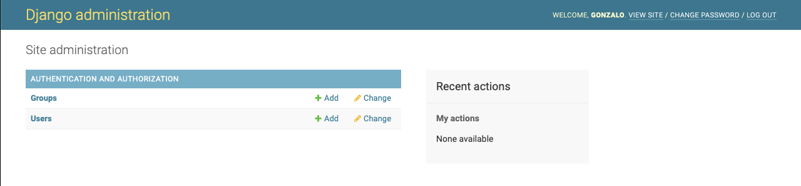

# Clase 1

¡Bienvenidos a la clase número 1!

Durante este curso van a aprender qué es una API REST, como construir una API REST y como probarla. A lo largo de las clases vamos a ir armando una API Bancaria, como dice la página inicial del curso. Durante las clases vamos a estar usando la palabra `terminal`, en este caso va a ser sinónimo de `consola`, y es la consola o terminal de la computadora que estén usando.

Los contenidos de esta clase son:
- [Qué es una API](#qué-es-una-api)
- [Cómo se usa una API](#cómo-se-usa-una-api)
  * [Cómo se compone una request HTTP](#cómo-se-compone-una-request-http)
  * [Cómo hacemos una request HTTP](#cómo-hacemos-una-request-http)
- [Qué significa ser REST](#qué-significa-ser-rest)
  * [Recursos y URLs](#recursos-y-urls)
- [Qué es Django](#qué-es-django)
  * [Cómo empezar con Django](#cómo-empezar-con-django)
  * [Consola de Admin](#consola-de-admin)
  * [Cómo crear la API](#cómo-crear-la-api)
  * [Cuáles son los contenidos de lo que creamos](#cuáles-son-los-contenidos-de-lo-que-creamos)
- [Cómo se arma un endpoint](#cómo-se-arma-un-endpoint)
  * [Instalar DjangoRestFramework](#instalar-djangorestframework)
  * [Crear una View](#crear-una-view)
  * [Registrar la URL](#registrar-la-url)
  * [Probarlo](#probarlo)
- [Ejemplos de Endpoints](#ejemplos-de-endpoints)
- [Ejercicios](#ejercicios)
  * [Ejercicio 1 - Endpoint que Suma](#ejercicio-1---endpoint-que-suma)
  * [Ejercicio 2 - Endpoint que Suma 2](#ejercicio-2---endpoint-que-suma-2)
  * [Ejercicio 3 - Endpoint Bueno y Malo](#ejercicio-3---endpoint-bueno-y-malo)
- [Qué vamos a estar construyendo](#qué-vamos-a-estar-construyendo)

***

## Qué es una API

Una *API* es una **Application Programming Interface**. Básicamente es un intermediario entre 2 aplicaciones que necesitan comunicarse.

Se puede pensar la siguiente analogía:

```
Imagínense que están en un restaurante y tienen un menú para elegir. 
La cocina (o "server") va a preparar lo que ustedes pidan. 
Uno no va directamente a la cocina a pedir comida, necesita de un mozo (o "API") para poder comunicarle su pedido a la cocina. 
El mozo toma el pedido (o "request") y se lo lleva a la cocina, que una vez que prepara la comida (o "response"), se la devuelve al mozo y el mozo te lo lleva a tu mesa (o "cliente").
```

Una *API* se usa porque provee una mayor seguridad al servidor que está detrás de la misma, además de simplificar la comunicación entre el cliente y el servidor. 

***

## Cómo se usa una API

Hay varias formas de comunicarse con una API, pero nos vamos a concentrar en el estándar **HTTP** y como hacer un *HTTP Request*.

**HTTP** es el *[Hypertext Transfer Protocol](https://en.wikipedia.org/wiki/Hypertext_Transfer_Protocol)*, es un protocolo de aplicación basado en el esquema *request-response*. El cliente manda una *request* al servidor, y el servidor responde con una *response*.

HTTP define un [conjunto de métodos](https://developer.mozilla.org/en-US/docs/Web/HTTP/Methods) o **verbos HTTP** para indicar que acción se quiere ejecutar sobre el recurso deseado. Si bien hay muchos métodos, nos vamos a concentrar en los que vamos a usar durante el curso:
 - **GET** --> Pide una representación del recurso especificado, es el más común de los métodos, los browsers lo usan cuando se busca algo en Google por ejemplo. *Solo debería buscar información*.
 - **POST** --> Sirve para crear o subir una entidad al recurso especificado.
 - **PUT** --> Sirve para reemplazar todas las representaciones del recurso especificado.
 - **DELETE** --> Borra el recurso especificado.

Si tuviéramos que resumir en 1 palabra para qué se usa cada método diríamos:
 - **GET** --> *buscar*
 - **POST** --> *crear*
 - **PUT** --> *actualizar*
 - **DELETE** --> *borrar*

### Cómo se compone una request HTTP

Toda [request HTTP](https://developer.mozilla.org/en-US/docs/Web/HTTP/Messages#http_requests) se compone de 4 partes:
 - Una "request line"
 - Cero o más [headers](https://developer.mozilla.org/en-US/docs/Web/HTTP/Headers) (uno en cada línea)
 - Una línea en blanco
 - Un "body" opcionalmente

Los *GET* y *DELETE* no llevan body.

### Cómo hacemos una request HTTP

Es muy simple hacer una request HTTP, hay muchas herramientas que permiten hacerlo, algunas ya vienen instaladas en la computadora, como **Curl** y otras se pueden instalar, como **Postman**, pero a fin de cuentas termina siendo un curl lo que hacen esas otras herramientas.

Vamos a probar hacer un GET (en este caso la request no tiene headers ni body) usando Curl (si no tienen Curl en sus computadoras, pueden usar esta [página](https://reqbin.com/curl) para hacerlas):
```bash
curl -XGET google.com
```

Esto debería devolver algo similar a:
```
HTTP/1.1 200 OK
Expires: -1
{MÁS HEADERS}
Transfer-Encoding: chunked

<!doctype html>{MÁS HTML}</html>
```

***

## Qué significa ser REST

**REST** significa *[Representational State Transfer](https://en.wikipedia.org/wiki/Representational_state_transfer)*, y es un estándar en la arquitectura de software.

Para que una API sea considerada *REST* o *RESTful* debe cumplir una serie de [criterios](https://www.redhat.com/en/topics/api/what-is-a-rest-api):
 - Debe tener una arquitectura compuesta de clientes, servidores y recursos, con requests HTTP.
 - Debe ser **stateless** la comunicación entre cliente y servidor, no hay información de sesión guardada entre request y request, cada request debería tener todo lo necesario para poder resolverla.
 - Las interacciones deben ser cacheables.
 - Una interfaz uniforme entre los componentes, de manera que:
     + los recursos son identificables y distinguibles.
     + los recursos deben poder ser manipulables a partir de la representación recibida.
     + los mensajes deben ser descriptivos para indicarle al cliente como procesar la información.
     + hipertexto/hipermedia disponible, el cliente puede usar hipervínculos para acceder a la información relacionada con el recurso.
 - Un sistema en capas que organiza cada servidor involucrado en el procesamiento de una request, todo invisible para el cliente.
 - Código-on-demand (opcional), que es la habilidad de enviar código ejecutable del servidor al cliente para extender la funcionalidad del cliente 

*¿Por qué haríamos una API REST?* --> Seguir estos principios garantiza que la API sea más rápida y liviana, al mismo tiempo que es más escalable.

### Recursos y URLs

Hay ciertas convenciones que se siguen para un buen diseño de una API REST.
1. Las URLs contienen sustantivos solo, no verbos.
    - Las URLs serían del estilo `/api/users` y no `/api/user` o `/api/users/create`
2. Los sustantivos están en plural para consistencia.
3. Aprovechar los verbos HTTP para hacer que sea más legible.
    - Para crear un usuario se usa un POST a `/api/users`, de forma que la URL es corta y entendible
    - Si se quiere obtener a todos los usuarios es GET a `/api/users`, pero para un usuario particular es GET a `/api/users/<id>`
4. Usar los status codes para hacer referencia a los resultados de forma más intuitiva.
    - Si se crea un objeto, por ejemplo, no responder con 200 (OK), responder con 204 (No Content), ya que no hay contenido que se buscó

Si hay una clara jerarquía en las URLs, se puede usar, siempre y cuando no quedé muy grande. Por ejemplo, si los usuarios tienen fotos, la jerarquía puede ser `/api/users/<id>/fotos`, pero si cada foto tiene tags, usar `/api/users/<id>/fotos/<pid>/tags` es muy largo y engorroso. En ese caso conviene tener hasta `/api/users/<id>` y `/api/fotos/<pid>/tags`, de forma que queda más simple.

***

## Qué es Django

[Django](https://www.djangoproject.com/) es un framework de alto nivel de Python que alienta el desarrollo rápido y el diseño limpio de aplicaciones. Además es gratis y open-source.

Tiene un gran variedad de paquetes disponibles para no tener que reinventar cosas que ya existen, y se usa mucho porque es rápido, seguro y escalable.

Instagram, Pinterest y Mozilla, entre otros, usan Django.

### Cómo empezar con Django

Es muy simple crear un proyecto de Django, vamos a empezar por crear nuestro proyecto de API.

**OPCIONAL**: Crear un virtualenv (en este caso usamos *virtualenv*), iniciarlo y chequear que la versión de Python sea 3.x (usamos 3.8.5 en el curso):
```bash
# Crear el env
virtualenv ./cs_env
# Activarlo
source ./cs_env/bin/activate
# Ver versión de python
python --version
```

**NOTA**: Si están usando OSx(Mac), para usar Python 3 los comandos se hacen con `pip3` y `python3`.

En una terminal, muévanse al directorio que quieran usar e instalen django (si tienen experiencia con virtualenvs en Python, es recomendable que lo hagan en un virtualenv):
```bash
pip install django
```

Ahora vamos a crear el proyecto en sí, el nombre del proyecto sería "cs_api":
```bash
django-admin startproject cs_api
```

Este comando debería generar una carpeta con la siguiente estructura:
```
cs_api/
├── cs_api
│   ├── __init__.py
│   ├── asgi.py
│   ├── settings.py
│   ├── urls.py
│   └── wsgi.py
└── manage.py
```

En Django, cada vez que uno hace un cambio a un modelo de la base de datos, tenemos que correr las "migraciones". Estas [migraciones](https://docs.djangoproject.com/en/3.1/topics/migrations/) son la forma de Django de propagar la información a la base de datos.

Ahora, dentro de la primera carpeta "cs_api" (vamos a estar trabajando desde ahí con la terminal desde ahora), corremos el siguiente comando para hacer las migraciones:
```bash
python manage.py makemigrations && python manage.py migrate
```

Para correr el proycto, simplemente se usa el comando `runserver` de Django:
```bash
python manage.py runserver
```

Y el siguiente mensaje debería aparecer:
```
Watching for file changes with StatReloader
Performing system checks...

System check identified no issues (0 silenced).
January 29, 2021 - 18:51:25
Django version 3.1.5, using settings 'cs_api.settings'
Starting development server at http://127.0.0.1:8000/
Quit the server with CONTROL-C.
```

Ya tenemos Django corriendo, podemos verlo si entramos desde un browser a `http://localhost:8000/`. Luego de ver que haya andado bien, vamos a apagar al servidor apretando `ctrl + c` para poder continuar.

### Consola de Admin

Django tiene 2 partes, lo que uno codea y hace disponible, y la consola de admin (que se puede desactivar). Por ahora vamos a concentrarnos en la consola de admin.

Esta consola sirve para administrar las tablas y configuraciones de Django. Para poder entrar necesitamos un usuario con el rol "superuser", y vamos a crearlo.

Para poder crear a este usuario, hay que correr el siguiente comando:
```bash
python manage.py createsuperuser
```

Este comando va a generar que la terminal pida un nombre de usuario, mail y contraseña, hay que completar esto. Debería verse así:
```
Username (leave blank to use 'gonzalo'): gonzalo
Email address: ghirsch@itba.edu.ar
Password: 
Password (again): 
Superuser created successfully
```

Una vez creado el usuario volvemos a correr el servidor (`python manage.py runserver`) y desde un browser entramos a `http://localhost:8000/admin/login/` y nos logueamos con el usuario que acabamos de crear. Deberían ver algo así:


Actualmente solo vamos a poder ver a los usuarios y a los grupos, que son los roles que puede tener un usuario (que no hay roles cargados).

Si se ponen a investigar, van a ver que el único usuario que aparece es el usuario que creamos, que tiene marcado que es staff y superuser.

### Cómo crear la API

Para poder empezar a hacer cosas más interesantes, necesitamos agregar una aplicación a nuestro proyecto de Django, la API. 

Para poder hacer esto, vamos a usar el siguiente comando, que se encarga de crear nuestra API que se va a llamar "api":
```bash
python manage.py startapp api
```

Esto va a generar una nueva carpeta llamada "api", y toda nuestra carpeta del proyecto se va a ver así:
```
cs_api/
├── api
│   ├── __init__.py
│   ├── admin.py
│   ├── apps.py
│   ├── models.py
│   ├── tests.py
│   └── views.py
├── cs_api
│   ├── __init__.py
│   ├── asgi.py
│   ├── settings.py
│   ├── urls.py
│   └── wsgi.py
├── db.sqlite3
└── manage.py
```

Ahora hay que registrar a nuestra API dentro del archivo `cs_api/settings.py`, y lo hacemos cambiando *INSTALLED_APPS*:
```python
INSTALLED_APPS = [
    'api.apps.ApiConfig',
    ... # Dejar el resto de lo que estaba listado
]
```

Ahora corremos el proyecto otra vez para ver que todo esté en orden:
```bash
python manage.py runserver
```

### Cuáles son los contenidos de lo que creamos

Estuvimos creando muchas cosas, y se agregaron muchos archivos, vamos a ver para qué sirve cada uno:
```
cs_api/ --> Carpeta del proyecto
├── api --> Carpeta de nuestra API
│   ├── __init__.py
│   ├── admin.py --> Registrar modelos así aparecen en la consola de admin
│   ├── apps.py --> App que se registra en settings.py
│   ├── models.py --> Definir modelos de la API
│   ├── tests.py --> Escribir los tests
│   └── views.py --> Definir los endpoints
├── cs_api --> Carpeta de configuración del proyecto
│   ├── __init__.py
│   ├── asgi.py --> Configuraciones (no modificamos)
│   ├── settings.py --> Configuraciones del proyecto
│   ├── urls.py --> Urls del proycto
│   └── wsgi.py --> Configuraciones (no modificamos)
├── db.sqlite3 --> Base de datos en SQLite
└── manage.py --> Scripts para correr, migrar y otras cosas (no hace falta modificar)
```

Es importante notar que todo lo que es Models, Views y Tests no necesariamente tiene que estar dentro de esos archivos, sino que puede estar en subcarpetas.

***

## Cómo se arma un endpoint

**¿Qué es un "Endpoint"?**, un "Endpoint" es una URL de la API que decidimos exponer, y que contiene una acción que se puede hacer (el verbo HTTP) sobre un recurso (el especificado por la URL)

Para poder armar un endpoint, hace falta tener una función dentro de "views" y registrar la función con su URL dentro de "urls".

### Instalar DjangoRestFramework

Para poder empezar a ver como se arma un endpoint, tenemos que instalar un paquete, el [djangorestframework](https://www.django-rest-framework.org/):
```bash
pip install djangorestframework
````

Este paquete se usa para crear APIs especialmente.

Y ahora falta agregarlo a la lista de *INSTALLED_APPS* dentro de `cs_api/settings.py`:
```python
INSTALLED_APPS = [
    # Dejar igual el resto de las installed apps
    ...
    'rest_framework',
]
```

### Crear una View

Hay 2 formas de crear una *View*, hay un enfoque funcional (creamos funciones para los endpoints) y otro con clases (creamos clases para los endpoints). Cada uno tiene sus pros y contras, pero vamos a estar usando el enfoque funcional porque es más fácil de entender y escribir.

Dentro de `api/views.py` vamos a crear una función `test_get`:
```python
# Imports necesarios
from rest_framework.decorators import api_view
from rest_framework.response import Response
from rest_framework import status

@api_view(['GET'])
def test_get(request):
    return Response({"hello": "world"}, status=status.HTTP_200_OK)
```

La parte `@api_view` es un "decorator", en Django vamos a usar este decorator para definir el método con que se puede usar este endpoint. Se puede especificar 1 o más métodos, separados por `,`. Por ejemplo, si queremos que acepte GET y POST, sería `@api_view(['GET', 'POST'])`, y en caso de pegarle con un PUT, devuelve una respuesta con 405 (Method Not Allowed).

La parte `return Response({"hello": "world"}, status=status.HTTP_200_OK)` se ocupa de devolver el mapa `{"hello": "world"}` en el body de la respuesta, y especificamos también el status con `status=status.HTTP_200_OK`. En este caso simplemente devolvemos un 200 porque está todo bien.

La función recibe una `request`, que tiene información sobre le HTTP request, como headers y el body.

### Registrar la URL

Una vez creada la view, simplemente hay que importarla en `cs_api/urls.py` y agregarla de la siguiente manera:
```python
from api import views
...
urlpatterns = [
    ...
    path('api/test', views.test_get, name='test_get')
]
```

La parte `'api/test'` es la URL a la que va a estar mapeada nuestra view, para acceder usaríamos `localhost:8000/api/test` con un GET.

La parte `views.test_get` indica que la función que usamos es la que definimos antes.

La parte `name='test_get'` sirve como un nombre alternativo a la URL, por si se busca referenciarla directo por nombre.

Es **importante** notar que el orden de las URLs importa, Django usa la función que primero matchea con la URL. Por ejemplo, si tenemos las URLs declaradas de esta forma:
```python
urlpatterns = [
    ...
    path('api/foo/bar', ...)
    path('api/foo', ...)
]
```

La URL `'api/foo/bar'` matchea para la request que vaya a `'api/foo/bar'` y para la que vaya a `'api/foo'`. 

En cambio, si definimos las URLs de esta forma:
```python
urlpatterns = [
    ...
    path('api/foo', ...)
    path('api/foo/bar', ...)   
]
```

Cada request va a matchear bien con la URL que corresponde.

### Probarlo

Una vez agregada la URL, volvemos a correr el proyecto (`python manage.py runserver`) y probamos con Curl el endpoint:
```bash
curl localhost:8000/api/test
```

Deberían obtener esto:
```
{"hello":"world"}
```

## Ejemplos de Endpoints

Hay diferentes formas de pasarle información a un endpoint:
- Path Params --> Se usa una URL de este estilo `/api/users/10`, en donde `10` es el ID del usuario, y es un Path Param
- Query Params --> Se usa una URL de este estilo `/api/users?q=hola&p=1`, en donde hay 2 query params, `q` y `p`, separados por un `&` y separados de la URL con un `?`
- Body --> Es el cuerpo de la request
- Form --> El cuerpo de la request, pero va con un formato especial

Como armamos un endpoint con Path Params:
```python
# api/views.py
@api_view(['GET'])
def test_get_path_param(request, id):
    # El parametro id se pone en los parametros de la funcion
    return Response({"hello": id}, status=status.HTTP_200_OK)

# cs_api/urls.py
urlpatterns = [
    ...,
    # Agregamos <TIPO:NOMBRE>, y usamos un int con nombre 'id'
    path('api/test/<int:id>', views.test_get_path_param, name='test_get_path_param') 
]

# Probamos con curl y vemos que aparece el numero en la respuesta
curl localhost:8000/api/test/40
curl localhost:8000/api/test/20
```

Como armamos un endpoint con Query Params (por default todos los query params se reciben como string):
```python
# api/views.py
@api_view(['GET'])
def test_get_query_param(request):
    # Obtenemos el parametro 'q', y si no viene se le pone 'default'
    q = request.GET.get('q', 'default')
    return Response({"hello": q}, status=status.HTTP_200_OK)

# cs_api/urls.py
urlpatterns = [
    ...,
    path('api/test/query', views.test_get_query_param, name='test_get_query_param'),
]

# Probamos con curl y vemos que aparece el parametro en la respuesta
curl localhost:8000/api/test/query?q=hola
curl localhost:8000/api/test/query?q=chau
curl localhost:8000/api/test/query
```

Como armamos un endpoint con Body:
```python
# api/views.py
@api_view(['POST'])
def test_post_body(request):
    # El body se encuentra en "request.data"
    return Response({"hello": request.data}, status=status.HTTP_200_OK)

# cs_api/urls.py
urlpatterns = [
    ...,
    path('api/test/body', views.test_post_body, name='test_post_body'),
]

# Probamos con curl y vemos que aparece el body en la respuesta
curl --header "Content-Type: application/json" -XPOST --data '{"username":"xyz","password":"xyz"}' http://localhost:8000/api/test/body
curl --header "Content-Type: application/json" -XPOST --data '{"computer":"society","django":"itba"}' http://localhost:8000/api/test/body
curl --header "Content-Type: application/json" -XPOST http://localhost:8000/api/test/body
```

## Ejercicios

Además del endpoint que se pide, incluyan diferentes casos para probar (con Curl incluido), e ideas de que puede romper al endpoint.

### Ejercicio 1 - Endpoint que Suma

Armar un endpoint GET que tenga la URL `/api/suma` que tenga 2 query params (`l` y `r`), y devuelva un JSON con el resultado de esta forma: `{"resultado": N}`. 

Se debería poder llamar así con Curl:
```
# Llamado
curl 'localhost:8000/api/suma?l=10&r=20'
# Respuesta
{"resultado": 30.0}
```

No hace falta validar los parámetros

### Ejercicio 2 - Endpoint que Suma 2

Armar un endpoint PUT que tenga la URL `/api/suma-mas` que reciba en el body, un JSON de esta forma `{"sums": [1, 2, 3, N]}`. Recibe una lista de números que tiene que sumar. Se espera que devuelva un JSON con el resultado de esta forma: `{"resultado": N}`.

Se debería poder llamar así con Curl:
```
# Llamado
curl --header "Content-Type: application/json" -XPUT --data '{"sums":[1,2,3,4,5,6]}' http://localhost:8000/api/suma-mas
# Respuesta
{"resultado": 21}
```

### Ejercicio 3 - Endpoint Bueno y Malo

Armar un endpoint POST que tenga la URL `/api/bueno` que reciba en el body, un JSON de esta forma `{"n": N}` y tenga 1 query param (`limit`). Recibe un único número en el body, y un único número de query param. Se espera que devuelva el código 200 si el número es mayor o igual que el query param `limit`, sino un codigo 400 si es menor. Por default el límite es 10.

Se debería poder llamar así con Curl:
```
# Llamado
curl -i --header "Content-Type: application/json" -XPOST --data '{"n":10}' http://localhost:8000/api/bueno?limit=11
# Respuesta
HTTP/1.1 400 Bad Request

# Llamado
curl -i --header "Content-Type: application/json" -XPOST --data '{"n":10}' http://localhost:8000/api/bueno?limit=8
# Respuesta
HTTP/1.1 200 OK

# Llamado
curl -i --header "Content-Type: application/json" -XPOST --data '{"n":10}' http://localhost:8000/api/bueno
# Respuesta
HTTP/1.1 200 OK
```

## Qué vamos a estar construyendo

Como mencionamos al principio, vamos a armar una API REST Bancaria, que va a tener los siguientes URLs (la base de la API es `/api`):
- `/accounts` con POST              --> Registrar a un usuario
- `/accounts` con GET               --> Obtener a los usuarios de la API
- `/accounts/<id>` con GET          --> Obtener información del usuario especificado
- `/accounts/<id>` con DELETE       --> Borrar a un usuario
- `/accounts/<id>` con PUT          --> Agregarle fondos al usuario o cambiarle el rol si uno es admin
- `/transactions` con POST          --> Armar una transacción que recibe `destino` y `cantidad` en el body
- `/transactions` con GET           --> Obtener historial de transacciones
- `/auth/login` con POST            --> Loguearse en la API

Esta es la especificación de la API que vamos a empezar a armar la clase que viene, obviamente cada endpoint tiene más detalles que se verán al momento de que los encaremos.

***

Eso es todo por esta clase, pueden seguir con la [clase 2](clase-2.md)
